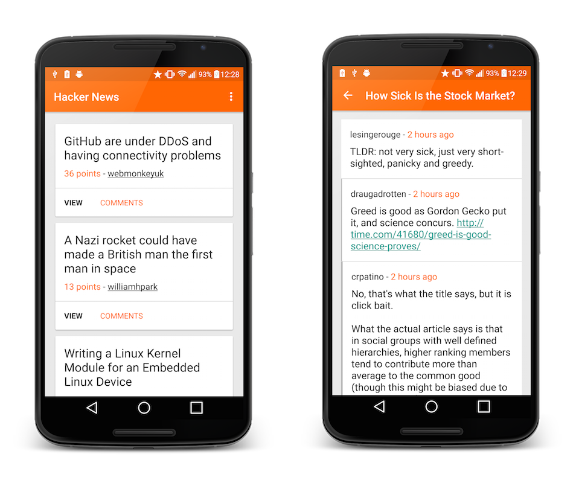

MVVM Hacker News using the official Data Binding Library
========================================================

I wanted to experiment creating an MVVM structured project using the official Data Binding library,
so I stripped back an [old project](https://github.com/hitherejoe/HackerNewsReader) of mine and replaced relevant codebase with an MVVM approach. This is still experimental,
so I'd love to hear any suggestion / improvements to the approach!

    

Currently writing a Medium article which should explain more... but for now:

Posts
-----

Post cards displayed on the Post Screen (left, above) are built using the following classes:

[Post]() - The post object
[PostAdapter]() - The RecyclerView adapter used to set the view model
[PostViewModel]() - The view model used to manage the display of the posts
[item_post]() - The XML layout file which displays the post card

Comments
--------

Comments displayed on the Comment Screen (right, above) are built using the following classes:

[Comment]() - The comment object
[CommentAdapter]() - The RecyclerView adapter used to set the corresponding view model. Comments work a bit differently
from posts as this adapter uses logic to choose to use one of two view models based on the comment type
[CommentViewModel]() - The view model used for standard comments on a post
[CommentsHeaderViewModel]() - The view model used as a header for the post text with an ASK post
[item_comment]() - The XML layout file which displays a standard comment
[item_comments_header]() - The XML layout file used to display the header for an ASK post

Requirements
------------

 - [Android SDK](http://developer.android.com/sdk/index.html).
 - Android [5.1 (API 22) ](http://developer.android.com/tools/revisions/platforms.html#5.1).
 - Android SDK Tools
 - Android SDK Build tools 23.0.0.0
 - Android Support Repository
 - Android Support library

Building
--------

To build, install and run a debug version, run this from the root of the project:

    ./gradlew installRunDebug
    
Testing
--------

To run **unit** tests on your machine using [Robolectric] (http://robolectric.org/):

    ./gradlew testDebugUnitTest
    
To run automated tests on connected devices:

    ./gradlew connectedAndroidTest
